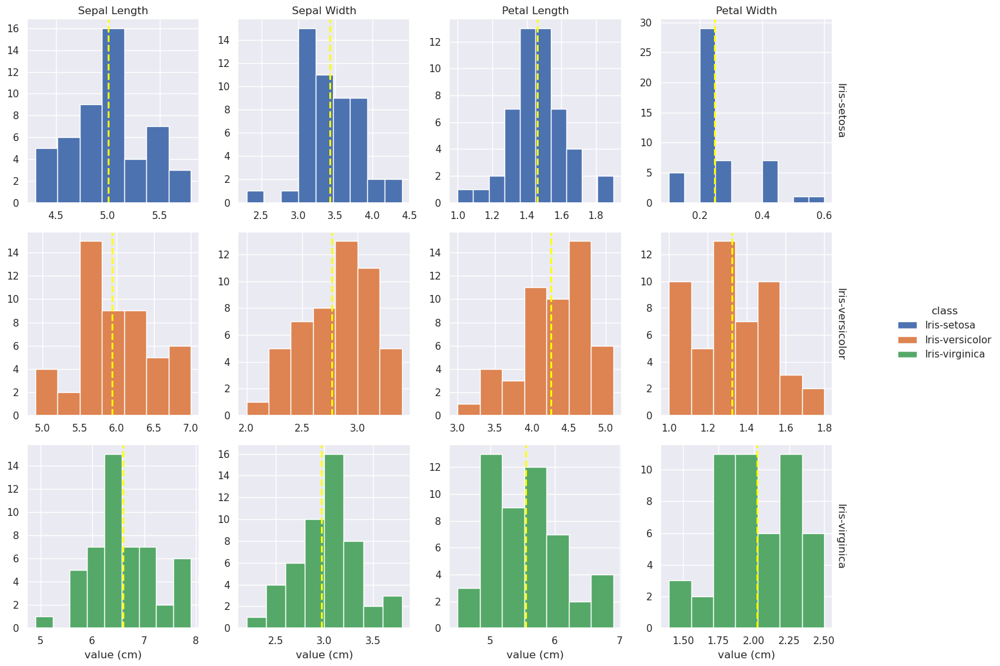

# The Fisher Iris Data Set

HDip Data Analytics Programming and Scripting Project

## Introduction
Fisher's Iris Data set is a collection of 50 observations of four measurements — sepal length, sepal width, petal length, and petal width from each of three plant species: *Iris setosa*, *I. versicolor*, and *I. virginica*. Two of these sets (*I. setosa* and *I. versicolor*) were collected from plants growing together in the same colony, while the third (*I. virginica*) was collected from a separate site (Fisher, 1936). *I. setosa* is linearly separable from the other two species based on some of the four measurements recorded whereas *I. vesicolor* and *I. virginica* are not (*ibid.*).

This project uses the Python programming language to perform an exploratory data analysis (EDA) on the iris dataset and to examine some approaches to data classification using Python libraries.

## Requirements

This project was made using the following Python version and package versions:

- Python 3.9.3
- pandas 1.2.4
- numpy 1.19.2
- matplotlib 3.3.4
- seaborn 0.11.1

## How to run this project


## Data preparation

The dataset used for this project was downloaded from the [UCI Machine Learning Repository](http://archive.ics.uci.edu/ml/datasets/Iris/) (Dua and Graff, 2019).
The data as downloaded consists of three files: [iris.data](iris_data/iris.data); the dataset as originally uploaded to the repository, [bezdekIris.data](iris_data/bezdekIris.data); the same data with some errors corrected (ibid.), and [iris.names](iris_data/iris.names); a description of the data along with some summary statistics noting, in particular, a high correlation between class and both petal length and petal width.

The data is imported to a pandas ```DataFrame``` (hereafter referred to informally as dataframe) using ```pandas.read_csv()``` (REF). The output of a call to ```DataFrame.head()``` which returns the top five rows of a dataframe (REF) is reproduced below:

<!--  -->

|    |   Sepal Length |   Sepal Width |   Petal Length |   Petal Width | class       |
|----|----------------|---------------|----------------|---------------|-------------|
|  0 |            5.1 |           3.5 |            1.4 |           0.2 | Iris-setosa |
|  1 |            4.9 |           3   |            1.4 |           0.2 | Iris-setosa |
|  2 |            4.7 |           3.2 |            1.3 |           0.2 | Iris-setosa |
|  3 |            4.6 |           3.1 |            1.5 |           0.2 | Iris-setosa |
|  4 |            5   |           3.6 |            1.4 |           0.2 | Iris-setosa |

<!--  -->

The data has been organised such that the values for each of the four features -- Sepal Length, Sepal Width, Petal Length, and Petal Width -- are held in their own columns, while a fifth column designates the class, or species. Calling ```iris["class"].unique()``` returns ```array(['Iris-setosa', 'Iris-versicolor', 'Iris-virginica'], dtype=object)```, demonstrating that the class column contains 3 unique values; Iris-setosa, Iris-versiolor, and Iris-virginica. Each row of the dataframe represents a separate observation.

Grouping the dataset by class shows there are 50 observations of each of the 4 variables for each class:

```iris.groupby("class").count()```

<!--  -->

| class           |   Sepal Length |   Sepal Width |   Petal Length |   Petal Width |
|-----------------|----------------|---------------|----------------|---------------|
| Iris-setosa     |             50 |            50 |             50 |            50 |
| Iris-versicolor |             50 |            50 |             50 |            50 |
| Iris-virginica  |             50 |            50 |             50 |            50 |

<!--  -->

The dataframe as described holds the data in 'wide' format, i.e. observations are in rows and variables are in columns, each row holding observations for a number of variables ([REF](https://seaborn.pydata.org/tutorial/data_structure.html)). This is a useful format for some applications and it is certainly a good compact and intuitive format for visual examination; however, it will also be necessary to generate a 'long' format dataframe, in which each row contains just a single observation. This format is often more flexible for plotting as columns can simply be assigned to, for instance, x-axis, y-axis, colour, etc. There are cases where one is more convenient than the other and both are used here.

The pandas ```DataFrame.melt()``` method transforms a wide-form dataframe to a long form one by placing all of the values in one column and adding columns for the grouping variables ([REF](https://pandas.pydata.org/pandas-docs/dev/reference/api/pandas.DataFrame.melt.html)). The output of ```DataFrame.head()``` on the long-form dataframe is shown below:

<!--  -->

<!--  -->

## Tasks
### EDA
1. Generate descriptive statistics for the dataset.
    [link](summary_stats.md)

<!--  -->

|       |   Sepal Length |   Sepal Width |   Petal Length |   Petal Width |
|-------|----------------|---------------|----------------|---------------|
| count |         150    |        150    |         150    |        150    |
| mean  |           5.84 |          3.06 |           3.76 |          1.2  |
| std   |           0.83 |          0.44 |           1.77 |          0.76 |
| min   |           4.3  |          2    |           1    |          0.1  |
| 25%   |           5.1  |          2.8  |           1.6  |          0.3  |
| 50%   |           5.8  |          3    |           4.35 |          1.3  |
| 75%   |           6.4  |          3.3  |           5.1  |          1.8  |
| max   |           7.9  |          4.4  |           6.9  |          2.5  |

<!--  -->

<table style="font-size: x-small;">
<tr>
<th> Petal Length </th>
<th> Petal Width </th>
</tr>
<tr>
<td>

<!--  -->

|       |   Iris-setosa |   Iris-versicolor |   Iris-virginica |
|-------|---------------|-------------------|------------------|
| count |         50    |             50    |            50    |
| mean  |          1.46 |              4.26 |             5.55 |
| std   |          0.17 |              0.47 |             0.55 |
| min   |          1    |              3    |             4.5  |
| 25%   |          1.4  |              4    |             5.1  |
| 50%   |          1.5  |              4.35 |             5.55 |
| 75%   |          1.58 |              4.6  |             5.88 |
| max   |          1.9  |              5.1  |             6.9  |


<!--  -->

</td>
<td>


<!--  -->

|       |   Iris-setosa |   Iris-versicolor |   Iris-virginica |
|-------|---------------|-------------------|------------------|
| count |         50    |             50    |            50    |
| mean  |          0.25 |              1.33 |             2.03 |
| std   |          0.11 |              0.2  |             0.27 |
| min   |          0.1  |              1    |             1.4  |
| 25%   |          0.2  |              1.2  |             1.8  |
| 50%   |          0.2  |              1.3  |             2    |
| 75%   |          0.3  |              1.5  |             2.3  |
| max   |          0.6  |              1.8  |             2.5  |


<!--  -->

</td>
</tr>
<tr>
<th> Sepal Length </th>
<th> Sepal Width</th>
</tr>
<tr>
<td>

<!--  -->

|       |   Iris-setosa |   Iris-versicolor |   Iris-virginica |
|-------|---------------|-------------------|------------------|
| count |         50    |             50    |            50    |
| mean  |          5.01 |              5.94 |             6.59 |
| std   |          0.35 |              0.52 |             0.64 |
| min   |          4.3  |              4.9  |             4.9  |
| 25%   |          4.8  |              5.6  |             6.22 |
| 50%   |          5    |              5.9  |             6.5  |
| 75%   |          5.2  |              6.3  |             6.9  |
| max   |          5.8  |              7    |             7.9  |


<!--  -->

</td>
<td>

<!--  -->

|       |   Iris-setosa |   Iris-versicolor |   Iris-virginica |
|-------|---------------|-------------------|------------------|
| count |         50    |             50    |            50    |
| mean  |          3.43 |              2.77 |             2.97 |
| std   |          0.38 |              0.31 |             0.32 |
| min   |          2.3  |              2    |             2.2  |
| 25%   |          3.2  |              2.52 |             2.8  |
| 50%   |          3.4  |              2.8  |             3    |
| 75%   |          3.68 |              3    |             3.18 |
| max   |          4.4  |              3.4  |             3.8  |


<!--  -->

</td>
</tr>
</table>

<!--  -->



<!--  -->


2. Generate histograms for each measurement
3. Generate scatterplots / pairplots for all of the variables
4. Examine some other descriptive plots:
    1. Box plot
    2. Violin plot
    3. Bee swarm plot
    4. Empirical Cumulative Distribution Function (eCDF)

### Correlation
1. Covariance
2. ρ (Pearson correlation)
3. Variability due to codependence / independent variability

### Separation improvement
1. Dimensionality reduction
    1. LDA
    2. PCA

### Uncertainty measurement
1. Probability of misclassification
2. identification of high probability areas
3. Identification on plots of areas with higher likelihood of misclassification (density surface?)

### Machine learning
1. Unsupervised classification
2. Supervised classification
3. Function estimation

## References

Dua, D. and Graff, C. (2019). UCI Machine Learning Repository [http://archive.ics.uci.edu/ml]. Irvine, CA: University of California, School of Information and Computer Science. 

Fisher, R.A. (1936). The use of multiple measurements in taxonomic problems, Annual Eugenics, 7, Part II, 179-188 

https://stackoverflow.com/a/59852474 (markdown columns)
https://pypi.org/project/tabulate/ (tablefmt option in pandas.DataFrame.to_markdown())
https://seaborn.pydata.org/tutorial/data_structure.html --- long vs wide formats
https://pandas.pydata.org/pandas-docs/stable/reference/api/pandas.melt.html --- dataframe.melt()
https://www.opentechguides.com/how-to/article/pandas/193/index-slice-subset.html --- dataframe slicing
https://towardsdatascience.com/7-points-to-create-better-histograms-with-seaborn-5fb542763169 --- histograms
https://stackoverflow.com/a/31688467 --- On setting titles on facetgrids
https://blogs.sas.com/content/iml/2012/08/09/discriminating-fishers-iris-data-by-using-the-petal-areas.html --- LDA and a trick
https://www.machinecurve.com/index.php/2020/05/05/how-to-create-a-confusion-matrix-with-scikit-learn/ --- confusion matrix

https://stackoverflow.com/a/29814281 --- facetgrid title