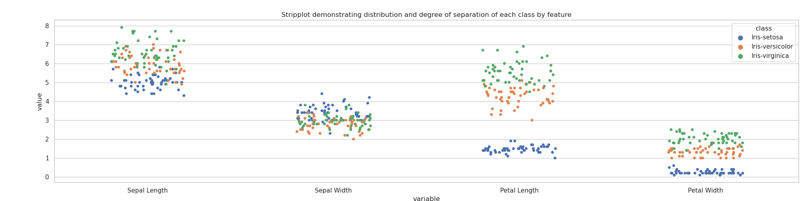
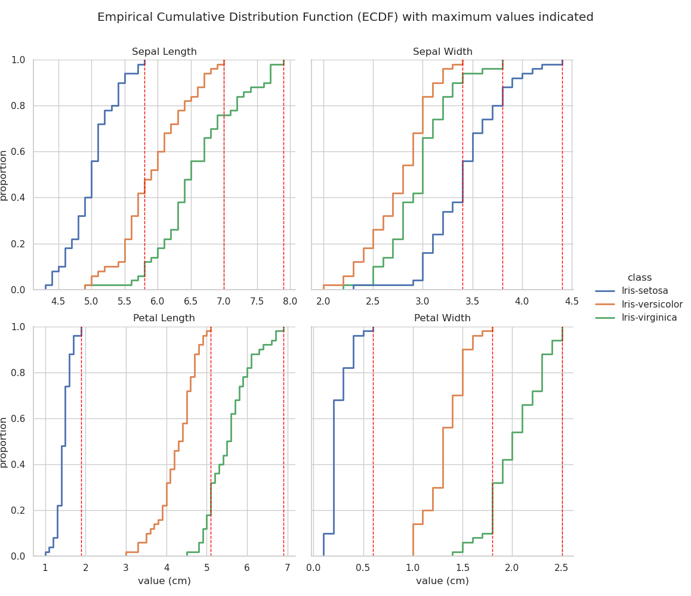
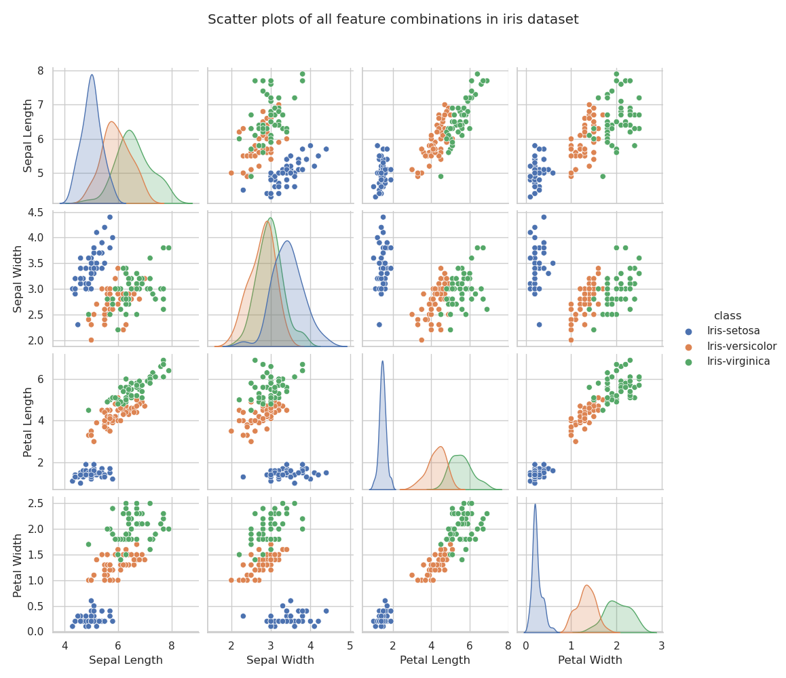
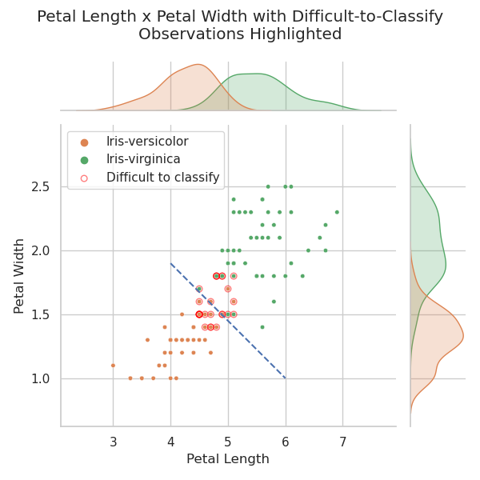
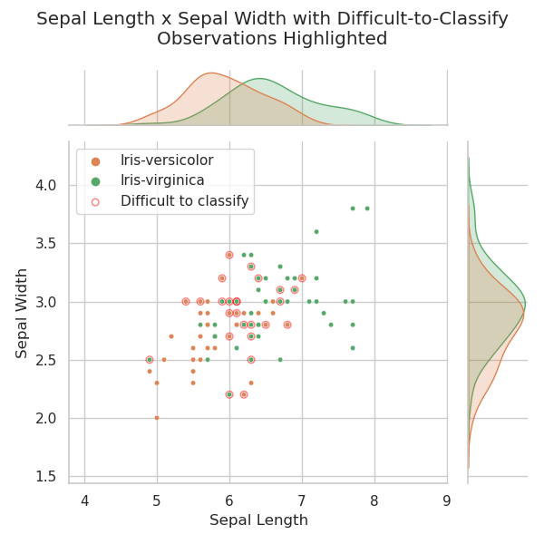
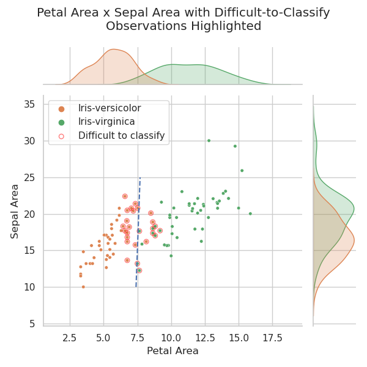

# The Fisher Iris Data Set

HDip Data Analytics Programming and Scripting Project

<!-- TOC -->

- [Introduction](#introduction)
- [Requirements](#requirements)
- [How to run this project](#how-to-run-this-project)
- [Data preparation](#data-preparation)
- [Descriptive Statistics](#descriptive-statistics)
    - [Visualisation of Descriptive Statistics](#visualisation-of-descriptive-statistics)
        - [Histograms](#histograms)
        - [Boxplots](#boxplots)
        - [Stripplots](#stripplots)
        - [ECDF Empirical Cumulative Distribution Function](#ecdf-empirical-cumulative-distribution-function)
- [Correlation](#correlation)
    - [Visualisation of Correlation](#visualisation-of-correlation)
    - [Separation improvement](#separation-improvement)
- [Further Study](#further-study)
    - [Uncertainty measurement](#uncertainty-measurement)
    - [Machine learning](#machine-learning)
- [References](#references)

<!-- /TOC -->

## Introduction
Fisher's Iris Data set is a collection of 50 observations of four measurements — sepal length, sepal width, petal length, and petal width from each of three plant species: *Iris setosa*, *I. versicolor*, and *I. virginica*. Two of these sets (*I. setosa* and *I. versicolor*) were collected from plants growing together in the same colony, while the third (*I. virginica*) was collected from a separate site (Fisher, 1936). *I. setosa* is linearly separable from the other two species based on some of the four measurements recorded whereas *I. vesicolor* and *I. virginica* are not (*ibid.*).

This project uses the Python programming language to perform an exploratory data analysis (EDA) on the iris dataset and to examine some approaches to data classification using Python libraries.

## Requirements

This project was made using the following Python version and package versions:

- [Python 3.9.3](https://www.python.org/downloads/release/python-393/)
- [pandas 1.2.4](https://pandas.pydata.org/docs/)
- [numpy 1.19.2](https://numpy.org/)
- [matplotlib 3.3.4](https://matplotlib.org/)
- [seaborn 0.11.1](https://seaborn.pydata.org/)

## How to run this project

The code in this project is spread over three files:

1. [```analysis.py```](analysis.py). This file contains the main project code. It consists of three functions:  
   
   i. ```summarise()```, which produces descriptive statistics for the dataset as a whole and for the dataset broken down by class (iris variety),

   ii. ```output_table()```, which produces a dict of GitHub Markdown formatted tables containing the descriptive statistics produced by ```summarise()``` above, and
   
   iii. ```main()```, which consists of a series of commands — primarily calling on functions defined in [```analysis_util.py```](analysis_util.py) and [```analysis_plots.py```](analysis_plots.py) — to manipulate the data, generate plots, and write the result to this README file.

2. [```analysis_util.py```](analysis_util.py). This file contains code which helps generate the structure of the project and in particular this README file. It consists of three functions, two of which (```csv_to_df()``` and ```df_to_csv()```) are thin wrappers around the [```pandas```](https://pandas.pydata.org/) functions [```pandas.read_csv()```](https://pandas.pydata.org/pandas-docs/stable/reference/api/pandas.read_csv.html) and [```DataFrame.to_csv()```](https://pandas.pydata.org/pandas-docs/stable/reference/api/pandas.DataFrame.to_csv.html). The third function is ```insert_text()```, which, passed a dictionary consisting of labels and a file path, searches the target file for the keys of the passed dictionary in the form `````` and inserts, at that position, whatever content that key holds as its value. This function is used to insert all of the tables and plots generated by [```analysis.py```](analysis.py) at the correct positions in this README file.

3. [```analysis_plots.py```](analysis_plots.py). This file contains all of the code for generating the plots used in this project. Most of the functions are thin wrappers around plotting functions from the [```Seaborn```](https://seaborn.pydata.org/) plotting library with many of the parameters preselected. This functionality is given its own file in order to reduce the length and complexity of the main analysis file. The file contains seven functions, one of which, ```label_grid()```, is a helper function to help avoid code duplication in the application of labels to certain types of faceted plots, and the rest — ```histograms()```, ```boxplots()```, ```stripplot()```, ```scatterplot```, ```ecdfs()```, and ```pairplots()``` — are used to generate the various plots examined in this project.

The [```output```](output/) directory contains descriptive statistics in CSV format, and all of the plots used in this report, in png format. The [```iris_data```](iris_data/) directory contains all of the files pertaining to Fisher's iris data which were downloaded for the project. If the [```analysis.py```](analysis.py) file is run, and the correct libraries are available, the [```output```](output/) directory is populated with CSV files and images, and this current (README) file is populated with tables and links to the images that are output during the program run.

Note that the output of this software is this README.md file and the contents of the [output](output/) folder. The best way to run it is to download the entire repository so that the input iris data and the README.md file are all where the program expects them to be. If [analysis.py](analysis.py) is run without any changes to the project code, the README.md files and the contents of the output folder will be rewritten identically as they are now and the result will indistinguishable from the project as it currently exists.

## Data preparation

The dataset used for this project was downloaded from the [UCI Machine Learning Repository](http://archive.ics.uci.edu/ml/datasets/Iris/) (Dua and Graff, 2019).
The data as downloaded consists of three files: [iris.data](iris_data/iris.data); the dataset as originally uploaded to the repository, [bezdekIris.data](iris_data/bezdekIris.data); the same data with some errors corrected (ibid.), and [iris.names](iris_data/iris.names); a description of the data along with some summary statistics noting, in particular, a high correlation between class and both petal length and petal width.

The data is imported to a pandas ```DataFrame``` (hereafter referred to informally as dataframe) using [```pandas.read_csv()```](https://pandas.pydata.org/pandas-docs/stable/reference/api/pandas.read_csv.html). The output of a call to [```DataFrame.head()```](https://pandas.pydata.org/pandas-docs/stable/reference/api/pandas.DataFrame.head.html) which returns the top five rows of a dataframe is reproduced below:

<!--  -->

|    |   Sepal Length |   Sepal Width |   Petal Length |   Petal Width | class       |
|----|----------------|---------------|----------------|---------------|-------------|
|  0 |            5.1 |           3.5 |            1.4 |           0.2 | Iris-setosa |
|  1 |            4.9 |           3   |            1.4 |           0.2 | Iris-setosa |
|  2 |            4.7 |           3.2 |            1.3 |           0.2 | Iris-setosa |
|  3 |            4.6 |           3.1 |            1.5 |           0.2 | Iris-setosa |
|  4 |            5   |           3.6 |            1.4 |           0.2 | Iris-setosa |

<!--  -->

The data has been organised such that the values for each of the four features — Sepal Length, Sepal Width, Petal Length, and Petal Width — are held in their own columns, while a fifth column designates the class, or species. Calling [```iris["class"].unique()```](https://pandas.pydata.org/pandas-docs/stable/reference/api/pandas.Series.unique.html?highlight=unique#pandas.Series.unique) returns ```array(['Iris-setosa', 'Iris-versicolor', 'Iris-virginica'], dtype=object)```, demonstrating that the class column contains 3 unique values; Iris-setosa, Iris-versiolor, and Iris-virginica. Each row of the dataframe represents a separate observation.

Grouping the dataset by class shows there are 50 observations of each of the 4 variables for each class:

```iris.groupby("class").count()```

<!--  -->

| class           |   Sepal Length |   Sepal Width |   Petal Length |   Petal Width |
|-----------------|----------------|---------------|----------------|---------------|
| Iris-setosa     |             50 |            50 |             50 |            50 |
| Iris-versicolor |             50 |            50 |             50 |            50 |
| Iris-virginica  |             50 |            50 |             50 |            50 |

<!--  -->

The dataframe as described holds the data in 'wide' format, i.e. observations are in rows and variables are in columns, each row holding observations for a number of variables ([Waskom, 2020a](https://seaborn.pydata.org/tutorial/data_structure.html)). This is a useful format for some applications, and it is certainly a good compact and intuitive format for visual examination; however, it will also be necessary to generate a 'long' format dataframe, in which each row contains just a single observation. This format is often more flexible for plotting as columns can simply be assigned to the x-axis, y-axis, colour, etc. There are cases where one is more convenient than the other and both are used here.

The pandas ```DataFrame.melt()``` method transforms a wide-form dataframe to a long form one by placing all of the values in one column and adding columns for the grouping variables ([Pandas Development Team, 2021b](https://pandas.pydata.org/pandas-docs/dev/reference/api/pandas.DataFrame.melt.html)). The output of ```DataFrame.head()``` on the long-form dataframe is shown below:

<!--  -->

|    | class       | variable     |   value |
|----|-------------|--------------|---------|
|  0 | Iris-setosa | Sepal Length |     5.1 |
|  1 | Iris-setosa | Sepal Length |     4.9 |
|  2 | Iris-setosa | Sepal Length |     4.7 |
|  3 | Iris-setosa | Sepal Length |     4.6 |
|  4 | Iris-setosa | Sepal Length |     5   |

<!--  -->

<hr>

## Descriptive Statistics

Descriptive statistics for the dataset can be generated using the pandas ```DataFrame.describe()``` method. The count, mean, standard deviation, minimum value, maximum value, the median, and the first and third quartiles for each feature are calculated for the dataset as a whole. The result is shown in the table below. The data in this table has also been output to [```output/full.csv```](output/full.csv) in CSV format using the ```DataFrame.to_csv()``` method.

<!--  -->

|       |   Sepal Length |   Sepal Width |   Petal Length |   Petal Width |
|-------|----------------|---------------|----------------|---------------|
| count |         150    |        150    |         150    |        150    |
| mean  |           5.84 |          3.06 |           3.76 |          1.2  |
| std   |           0.83 |          0.44 |           1.77 |          0.76 |
| min   |           4.3  |          2    |           1    |          0.1  |
| 25%   |           5.1  |          2.8  |           1.6  |          0.3  |
| 50%   |           5.8  |          3    |           4.35 |          1.3  |
| 75%   |           6.4  |          3.3  |           5.1  |          1.8  |
| max   |           7.9  |          4.4  |           6.9  |          2.5  |

<!--  -->

Some useful information can be gleaned from this table even before the data is broken down by class for a finer-grained examination. Some observations that can be made are:

1. Sepals, with mean dimensions of 5.84 cm × 3.06 cm tend to be considerably larger than petals (3.76 × 1.2).
2. Petal size, on the other hand is much more variable than sepal size, as indicated both by the petal length standard deviation (1.77), and the range of petal lengths(6.9 - 1 = 5.9 cm) versus the range of sepal lengths (7.9 - 4.3 = 3.6 cm; standard deviation 0.83).

Based on the observations made above, and assuming that the high variability in petal size is at least partially contingent on iris species, it seems likely that petal dimension will be more useful in classifying iris samples than sepal dimension. One way of testing that hypothesis, and of generally learning more about the data, is to produce the same descriptive statistics broken down by class (i.e. iris variety). This is achieved using pandas ```DataFrame.groupby()``` method. The resulting tables appear below. Each table represents one of the four observed features (lengths and widths of petals and sepals), and each column of each table represents one of the three classes (*I. setosa*, *I. versicolor*, and *I. virginica*). The rows contain the same descriptive statistics as in the table above, for each combination of feature and class.


<table>
<tr>
<th> Petal Length </th>
<th> Petal Width </th>
</tr>
<tr>
<td>

<!--  -->

|       |   Iris-setosa |   Iris-versicolor |   Iris-virginica |
|-------|---------------|-------------------|------------------|
| count |         50    |             50    |            50    |
| mean  |          1.46 |              4.26 |             5.55 |
| std   |          0.17 |              0.47 |             0.55 |
| min   |          1    |              3    |             4.5  |
| 25%   |          1.4  |              4    |             5.1  |
| 50%   |          1.5  |              4.35 |             5.55 |
| 75%   |          1.58 |              4.6  |             5.88 |
| max   |          1.9  |              5.1  |             6.9  |


<!--  -->

</td>
<td>


<!--  -->

|       |   Iris-setosa |   Iris-versicolor |   Iris-virginica |
|-------|---------------|-------------------|------------------|
| count |         50    |             50    |            50    |
| mean  |          0.25 |              1.33 |             2.03 |
| std   |          0.11 |              0.2  |             0.27 |
| min   |          0.1  |              1    |             1.4  |
| 25%   |          0.2  |              1.2  |             1.8  |
| 50%   |          0.2  |              1.3  |             2    |
| 75%   |          0.3  |              1.5  |             2.3  |
| max   |          0.6  |              1.8  |             2.5  |


<!--  -->

</td>
</tr>
<tr>
<th> Sepal Length </th>
<th> Sepal Width</th>
</tr>
<tr>
<td>

<!--  -->

|       |   Iris-setosa |   Iris-versicolor |   Iris-virginica |
|-------|---------------|-------------------|------------------|
| count |         50    |             50    |            50    |
| mean  |          5.01 |              5.94 |             6.59 |
| std   |          0.35 |              0.52 |             0.64 |
| min   |          4.3  |              4.9  |             4.9  |
| 25%   |          4.8  |              5.6  |             6.22 |
| 50%   |          5    |              5.9  |             6.5  |
| 75%   |          5.2  |              6.3  |             6.9  |
| max   |          5.8  |              7    |             7.9  |


<!--  -->

</td>
<td>

<!--  -->

|       |   Iris-setosa |   Iris-versicolor |   Iris-virginica |
|-------|---------------|-------------------|------------------|
| count |         50    |             50    |            50    |
| mean  |          3.43 |              2.77 |             2.97 |
| std   |          0.38 |              0.31 |             0.32 |
| min   |          2.3  |              2    |             2.2  |
| 25%   |          3.2  |              2.52 |             2.8  |
| 50%   |          3.4  |              2.8  |             3    |
| 75%   |          3.68 |              3    |             3.18 |
| max   |          4.4  |              3.4  |             3.8  |


<!--  -->

</td>
</tr>
</table>

The suggestion above regarding the suitability of petal dimensions in classifying iris species is borne out by the class-grouped statistics. Here it can be seen that there is a considerable gap between both the mean petal widths, and the mean petal lengths of *I. setosa* and the other two classes. Looking first at petal length; *I. setosa* shows a mean petal length of 1.46 cm against 4.26 cm and 5.55 cm for *I. versicolor* and *I. virginica* respectively. Examining the minimum and maximum petal lengths for each class confirms that this is a good metric for class separation. The maximum petal length observed in an *I. setosa* specimen is 1.9 cm while the minimum observed in *I. versicolor* and *I. virginica* was 3 cm and 4.5 cm respectively. Petal length alone, therefore, is sufficient to separate *I. setosa* from the other two varieties.

As regards *I. versicolor* and *I. virginica*; there is an approximate 25% range overlap between these two species in terms of petal length as evinced by *I. versicolor*'s third quartile value of 4.6 cm against *I.virginica*'s minimum of 4.5 cm. This demonstrates that while petal length may contribute to the differentiation of theses two species, the separation, if based on this metric alone, will not be perfect.

The case with petal width is similar, albeit less pronounced. Certain identification of *I. setosa* appears to be possible using this metric alone, but the other two species will not be separated with the same certainty. Sepal dimensions don't appear to make a significant contribution to the problem of iris species identification.

<hr>

### Visualisation of Descriptive Statistics

Descriptive statistics, as demonstrated above, can be powerful summarisers of a dataset but the most powerful tool available for EDA is arguably visualisation. The use of some simple charts can provide considerable information more quickly and more intuitively than analysis of the underlying values directly.

#### Histograms

The Seaborn library ([Waskom, 2020c](https://seaborn.pydata.org/)), which is built on Matplotlib ([Matplotlib Development Team, 2021](https://matplotlib.org/)) offers a powerful and flexible interface for data visualisation. The histograms below are generated by applying the [```seaborn.displot()```](https://seaborn.pydata.org/generated/seaborn.displot.html) method to the long-form iris data.

<!--  -->


<!--  -->

It is clear from the upper histograms that there is little correlation between sepal dimension and class. The petal length and width histograms, on the other hand, clearly show that there is no overlap between the petal dimensions of *I. setosa* and those of the other two classes. Some overlap is evident between *I. versicolor* and *I. virginica* in terms of petal length and width but, especially in the case of petal width, the overlap is minimal, pointing to a high degree of correlation between the class and those two variables.

#### Boxplots

The boxplots below (generated using [```seaborn.catplot(... kind="box" ...)```](https://seaborn.pydata.org/generated/seaborn.catplot.html)) succinctly encode a wealth of information into a simple chart. The box itself represents the interquartile range, i.e. the distance between the first and the third quartiles — thus representing 50% of the range of values in the dataset if it is normally distributed. The vertical line inside the box represents the median. The 'whiskers' extend to 1.5x the inter-quartile range and any values outside of that range can be considered outliers and are represented by points.

<!--  -->


<!--  -->

In addition to encoding the structure of the data the boxplots can offer some insight into the problem of classification. It can be seen that neither sepal length nor width alone can be used to distinguish the class of an observation, but *I. setosa* can be identified using either petal length or width. Although none of the observed features is suitable for uniquely identifying *I. versicolor* or *I. virginica*, the bulk of the observations of those two varieties would be identifiable solely using one or other of the petal dimensions.

#### Stripplots

A similar story is told by the stripplot ([```seaborn.stripplot()```](https://seaborn.pydata.org/generated/seaborn.stripplot.html)) below. The less mixing occurring between classes, and the greater range — represented by the vertical spread of the markers — indicates greater separability of those classes.  

<!--  -->



<!--  -->

As such, the stripplot here appears to indicate that, while either petal width or length are sufficient to identify *I. setosa*, petal length is the clearer indicator. Petal length also appears to come closest to separating *I. versicolor* and *I. virginica*.

#### ECDF (Empirical Cumulative Distribution Function)

The final distribution plot that will be examined here is the ECDF ([Ford, 2020](https://data.library.virginia.edu/understanding-empirical-cumulative-distribution-functions/); [Waskom, 2020b](https://seaborn.pydata.org/generated/seaborn.ecdfplot.html)). The plot below was generated using [```seaborn.displot(... kind="ecdf" ...```](https://seaborn.pydata.org/generated/seaborn.displot.html)).

The ECDF plot visualises a function which returns, for any particular value, the proportion of the data that lies below that value — it is like a cumulative distribution curve. This can give useful insights into the structure of the data that may be less obvious in some of the other distribution plots. The faceted plot below shows the ECDF for each of the four observed features for each iris variety. Vertical dotted red lines are added at the maximum value for each feature so that the overlap, or region of possible misclassification, can be easily identified.

<!--  -->



<!--  -->

Examination of the first plot — *Sepal Length* — reveals that all sepal length measurements of *I. versicolor* which are below the maximum sepal length measured on *I. setosa* correspond to a proportion of ~0.4. This means that ~40% of *I. versicolor* samples observed are indistinguishable from *I. setosa* based on sepal length alone. Similarly, almost 80% of *I. virginica* samples overlap with *I. versicolor* in terms of sepal length. Clearly Sepal length is a poor indicator of iris species.

As noted previously, petal dimensions appear to provide the clearest metric for identification of iris species but, contrary to the assumption made above on observation of the stripplot, it is petal width rather than petal length that will probably provide the fewest misclassifications. This is confirmed by examining the bottom two ECDF plots. Note that the petal length overlap between *I. versicolor* and 
*I. virginica* accounts for almost 20% of the sample space, whereas, for petal width, the overlap covers less than 10%. 

Recall from the [descriptive statistics](#descriptive-statistics) section that the maximum value for *I. versicolor* petal width is 1.8 cm. This can be confirmed by querying the dataframe:

    np.max(iris[iris["class"]=="Iris-versicolor"]["Petal Width"])
    # Returns 1.8
 
  Another query, this time for all observations with a petal width value of 1.8 (```iris[iris["Petal Width"] == 1.8]```) returns the following result:


<!--  -->

|     |   Sepal Length |   Sepal Width |   Petal Length |   Petal Width | class           |
|-----|----------------|---------------|----------------|---------------|-----------------|
|  70 |            5.9 |           3.2 |            4.8 |           1.8 | Iris-versicolor |
| 103 |            6.3 |           2.9 |            5.6 |           1.8 | Iris-virginica  |
| 107 |            7.3 |           2.9 |            6.3 |           1.8 | Iris-virginica  |
| 108 |            6.7 |           2.5 |            5.8 |           1.8 | Iris-virginica  |
| 116 |            6.5 |           3   |            5.5 |           1.8 | Iris-virginica  |
| 123 |            6.3 |           2.7 |            4.9 |           1.8 | Iris-virginica  |
| 125 |            7.2 |           3.2 |            6   |           1.8 | Iris-virginica  |
| 126 |            6.2 |           2.8 |            4.8 |           1.8 | Iris-virginica  |
| 127 |            6.1 |           3   |            4.9 |           1.8 | Iris-virginica  |
| 137 |            6.4 |           3.1 |            5.5 |           1.8 | Iris-virginica  |
| 138 |            6   |           3   |            4.8 |           1.8 | Iris-virginica  |
| 149 |            5.9 |           3   |            5.1 |           1.8 | Iris-virginica  |

<!--  -->

There are eleven observations of 1.8 cm petal widths in *I. virginica* and just one in *I. versicolor*. This means that, if all observations with a petal width of 1.8 cm or higher was classified as *I. virginica*,
only one of those would be a misclassification. Furthermore, less than 10% of *I. virginica* remains to be classified after all observations with over 1.8 cm petal width. Therefore, based on just petal width a 90% correct identification is guaranteed between *I. versicolor* and *I. virginica*, along with 100% correct identification of *I. setosa*. 

Using a rule-based classification method like this, based tightly on observed data, carries a high risk of overfitting ([Wikipedia Contributors, 2021a](https://en.wikipedia.org/wiki/Overfitting)), where the classifier is too closely coupled to training data and unable to generalise successfully to new data. 


## Correlation

A correlation matrix can be produced using [```DataFrame.corr()```](https://pandas.pydata.org/pandas-docs/stable/reference/api/pandas.DataFrame.corr.html). This method produces, by default, a Pearson correlation coefficient matrix ([Pandas Development Team, 2021a](https://pandas.pydata.org/pandas-docs/stable/reference/api/pandas.DataFrame.corr.html); [Wikipedia Contributors, 2021b](https://en.wikipedia.org/wiki/Pearson_correlation_coefficient)), which shows a normalised (to -1, 1) measure of covariance between each pair of features in the dataframe. The table below is the output of ```iris.corr()```:

<!--  -->

|              |   Sepal Length |   Sepal Width |   Petal Length |   Petal Width |   Sepal Area |   Petal Area |
|--------------|----------------|---------------|----------------|---------------|--------------|--------------|
| Sepal Length |       1        |     -0.11757  |       0.871754 |      0.817941 |     0.67918  |     0.8573   |
| Sepal Width  |      -0.11757  |      1        |      -0.42844  |     -0.366126 |     0.643461 |    -0.288431 |
| Petal Length |       0.871754 |     -0.42844  |       1        |      0.962865 |     0.360909 |     0.958422 |
| Petal Width  |       0.817941 |     -0.366126 |       0.962865 |      1        |     0.368845 |     0.980333 |
| Sepal Area   |       0.67918  |      0.643461 |       0.360909 |      0.368845 |     1        |     0.454503 |
| Petal Area   |       0.8573   |     -0.288431 |       0.958422 |      0.980333 |     0.454503 |     1        |

<!--  -->

As noted in the explanatory file which accompanies the downloaded iris dataset, [iris.names](iris_data/iris.names), there is a high degree of correlation between petal length and petal width.


### Visualisation of Correlation

The relationships between each pair of variables can be visualised using a grid of scatterplots, known, in Seaborn, as a pairplot ([Waskom, 2020d](http://seaborn.pydata.org/generated/seaborn.pairplot.html)). The pariplot below was generated using ```seaborn.pairplot(... kind="scatter" ...)```. The pairplot is useful for quickly assessing which pairs of variables correlate with one another and also which are most capable of separating the classes.

<!--  -->



<!--  -->

Based on the observations already made in the discussion of descriptive statistics above, there are no surprises in this pairplot. *I. setosa* is easily separable from the other two varieties based on almost every combination of two features. *I. versicolor* and *I. virginica* are not completely separable, but it seems that plotting petal length against petal width comes closest to identifying species.

Because *I. setosa* is easily discriminated it can be removed from the dataframe to enable a sharper focus on the remaining two problematic (from a separability viewpoint) varieties. This is achieved by creating a new dataframe from a subset of the one that has been used up until now:

    # Remove easily classified I. setosa from dataframe
    iris_sub = iris[iris["class"].isin(["Iris-virginica", "Iris-versicolor"])]

It is also useful to identify the range of values for petal width and length within which classification is difficult using those two observed features. Using overlap values identified through examination of the [ECDF](#ecdf-empirical-cumulative-distribution-function) plots previously discussed, which are highlighted in the chart below, a new dataframe is created using only those observations:

    # Generate difficult to classify subset of Iris dataset
    iris_rule = iris[(iris["Petal Length"] >= 4.5) & 
                     (iris["Petal Length"] <= 5.1) & 
                     (iris["Petal Width"] >= 1.4) & 
                     (iris["Petal Width"] <= 1.8)]


<!--  -->


<!--  -->

Having removed the easily identifiable *I. setosa*, the following 'jointplot' ([Waskom, 2020e](http://seaborn.pydata.org/generated/seaborn.jointplot.html)) is produced. This is a scatterplot with distribution plots, such as kde plots or histograms, at the margins. The difficult-to-classify observations identified in the ecdf plot above are plotted on top of the regular scatterplot. Doing this will allow those observations to be tracked on plots of different feature combinations.

The plots below are generated using

    g = seaborn.jointplot(...)
    
and the overlaid dataset is plotted by referencing the original plot ([Stack Overflow Contributors, 2015b](https://stackoverflow.com/a/33544046)):

    g.ax_joint.scatter(...)

The chart below shows the correlation between petal width and petal length for *I. versicolor* and *I. virginica*. Red circles are drawn around the observations which fall into the overlapped portions of the ecdf plot above. These are the observations that can't be classified using one or other of the two features shown. The heavier red circles represent points where a number of observations occupy the same position on the scatterplot.


<!--  -->



<!--  -->


The plot above shows that *I. versicolor* and *I. virginica* are not linearly separable using a combination of petal width and petal length. This is not surprising as it has been noted many times including by Fisher (1936) in his seminal paper. However, note the dashed blue line separating the two classes — many of the “difficult-to-classify” *I. versicolor* observations are now unambiguously identified correctly.

To demonstrate the tracking of these ambiguous points, and to show the unsuitability of sepal dimensions for iris identification, sepal width is plotted against sepal length below. Difficult-to-classify points, as defined previously, are again identified.


<!--  -->



<!--  -->

There is no obvious correlation between sepal width and sepal length as displayed in the chart above. The difficult-to-classify points appear to be randomly distributed around the plot, implying that sepal dimension observations are unlikely to contribute to the identification of these samples.

### Separation improvement

A number of methods exist for reducing the dimensionality of data in order to increase the signal-to-noise ratio and improve classification. Two common methods are principal components analysis (PCA) ([Ali, 2019](https://medium.com/machine-learning-researcher/dimensionality-reduction-pca-and-lda-6be91734f567)) and linear discriminant analysis (LDA) (ibid.). In fact Fisher's (1936) paper which introduced the iris data was a demonstration, using the iris data of LDA.

Although PCA and LDA are beyond the scope of this project, an interesting and easily achieved dimensionality reduction method specific to this dataset is described by Wicklin (2012). This method involves assuming rectangular sepals and petals and calculating their areas (by length x width). These areas are then plotted against one another. This experiment is repeated below: 

<!--  -->



<!--  -->

As is evident in the chart above, dimensionality reduction by calculating leaf and sepal area is a quite effective aid to classification. Wicklin (2012) points out that it does almost as good a job as LDA.

## Further Study


### Uncertainty measurement
1. Probability of misclassification
2. identification of high probability areas
3. Identification on plots of areas with higher likelihood of misclassification (density surface?)

### Machine learning
1. Unsupervised classification
2. Supervised classification
3. Function estimation

## References

Ali, A. (2019). Dimensionality Reduction(PCA and LDA) with Practical Implementation. [online] <https://medium.com/machine-learning-researcher/dimensionality-reduction-pca-and-lda-6be91734f567> Accessed 25th April, 2021

DeJesus, J. (2019). What, Why, and How to Read Empirical CDF. [online] 
Available from: <https://towardsdatascience.com/what-why-and-how-to-read-empirical-cdf-123e2b922480> Accessed 23rd April, 2020

Dua, D. and Graff, C. (2019). UCI Machine Learning Repository Irvine, CA: University of California, School of Information and Computer Science. [online] Available from: <http://archive.ics.uci.edu/ml> Accessed: 21st March, 2021

Fisher, R.A. (1936). The use of multiple measurements in taxonomic problems, Annual Eugenics, 7, Part II, 179-188

Ford, C. (2020). Understanding Empirical Cumulative Distribution Functions. [online] Available from: <https://data.library.virginia.edu/understanding-empirical-cumulative-distribution-functions/> Accessed 23rd April, 2020

Galarnyk, M. (2018). Understanding Boxplots. [online] Available from: <https://towardsdatascience.com/understanding-boxplots-5e2df7bcbd51> Accessed 23rd April, 2020

Matplotlib Development Team. (2021). Matplotlib: Visualization with Python. [online] Available from: <https://matplotlib.org/> Accessed: 15th March, 2021

Open Tech Guides. (2019). Selecting, Slicing and Filtering data in a Pandas DataFrame. [online] Available from: <https://www.opentechguides.com/how-to/article/pandas/193/index-slice-subset.html> Accessed 7th April, 2020

Pandas Development Team. (2021a). pandas.DataFrame.corr Documentation. [online] Available from: <https://pandas.pydata.org/pandas-docs/stable/reference/api/pandas.DataFrame.corr.html> Accessed 26th April, 2020

Pandas Development Team. (2021b). pandas.melt Documentation. [online] Available from: <https://pandas.pydata.org/pandas-docs/stable/reference/api/pandas.melt.html> Accessed 21st April, 2020

Sawla, S. (2018). Iris Flower Classification. [online] Available from <https://medium.com/@srishtisawla/iris-flower-classification-fb6189de3fff> Accessed 29th April, 2020

Stack Overflow Contributors, (2015a). How to add a title to Seaborn Facet Plot. [online] Available from: <https://stackoverflow.com/a/29814281> Accessed 15th April, 2020

Stack Overflow Contributors, (2015b). Add data to a seaborn jointplot. [online] Available from: <https://stackoverflow.com/a/33544046> Accessed 23rd April, 2021

Stack Overflow Contributors, (2017a). Customizing annotation with Seaborn's FacetGrid. [online] Available from: <https://stackoverflow.com/a/31688467> Accessed 15th April, 2020

Stack Overflow Contributors, (2017b). Drawing Diagonal line (line of equality) on Seaborn Jointplot. [online] Available from: <https://stackoverflow.com/questions/31391553/> Accessed 29th April, 2020

Stack Overflow Contributors, (2020). Have two columns in Markdown. [online] Available from: <https://stackoverflow.com/a/59852474> Accessed 15th April, 2020

Tabulate Contributors. (2021). Tabulate 0.8.9 Documentation. [online] Available from: <https://pypi.org/project/tabulate/> Accessed 15th April, 2020

Versloot, C. (2020). How to create a confusion matrix with Scikit-learn? [online] <https://www.machinecurve.com/index.php/2020/05/05/how-to-create-a-confusion-matrix-with-scikit-learn/> Accessed 22nd April, 2021

Waskom, M. (2020a). Data structures accepted by seaborn. [online] Available from: <https://seaborn.pydata.org/tutorial/data_structure.html> Accessed 20th April, 2020

Waskom, M. (2020b). seaborn.ecdfplot Documentation. [online] Available from: <https://seaborn.pydata.org/generated/seaborn.ecdfplot.html> Accessed 24th April, 2020

Waskom, M. (2020c). seaborn: statistical data visualization. [online] Available from: <https://seaborn.pydata.org/> Accessed 1st April, 2020

Waskom, M. (2020d). seaborn.pairplot Documentation. [online] Available from: <http://seaborn.pydata.org/generated/seaborn.pairplot.html> Accessed 21st April, 2021

Waskom, M. (2020e). seaborn.jointplot Documentation. [online] Available from: <http://seaborn.pydata.org/generated/seaborn.jointplot.html> Accessed 21st April, 2021

Wikipedia Contributors. (2021a). Overfitting. [online] Available from: <https://en.wikipedia.org/wiki/Overfitting> Accessed 29th April, 2020

Wikipedia Contributors. (2021b). Pearson Correlation Coefficient. [online] Available from: <https://en.wikipedia.org/wiki/Pearson_correlation_coefficient> Accessed 26th April, 2020

Wicklin, R. (2012). Discriminating Fisher's iris data by using the petal areas. [online] Available from: <https://blogs.sas.com/content/iml/2012/08/09/discriminating-fishers-iris-data-by-using-the-petal-areas.html> Accessed: 15th April, 2021

Yildrim Soner (2020). 7 Points to Create Better Histograms with Seaborn [online] Available from: <https://towardsdatascience.com/7-points-to-create-better-histograms-with-seaborn-5fb542763169> Accessed 13th April, 2020


